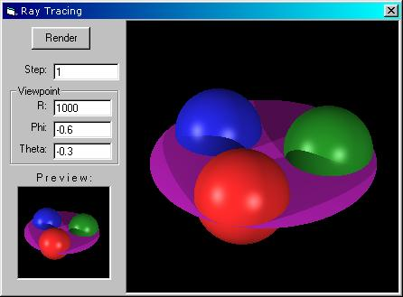



## RayTrace 1\.1

### Description

This is the new version of my RayTrace program. It now includes:

* Ray Tracing for disk objects

* Ray Tracing for infinite plane objects

* Shadow bug fixed

* Preview screen

* Viewpoint control (R, phi, theta)

* Ambient lighting

* Diffuse lighting

* Specular lighting

Coming soon: V 1.2; with reflective objects, cylinders, translucency and refraction, and texture mapped objects!!!
 
### More Info
 

             |
---                |---
**Submitted On**   |2000-12-08 21:54:28
**By**             |[Filip](https://github.com/Planet-Source-Code/PSCIndex/blob/master/ByAuthor/filip.md)
**Level**          |Advanced
**User Rating**    |4.6 (55 globes from 12 users)
**Compatibility**  |VB 6\.0
**Category**       |[Graphics](https://github.com/Planet-Source-Code/PSCIndex/blob/master/ByCategory/graphics__1-46.md)
**World**          |[Visual Basic](https://github.com/Planet-Source-Code/PSCIndex/blob/master/ByWorld/visual-basic.md)
**Archive File**   |[CODE\_UPLOAD125011292000\.zip](https://github.com/Planet-Source-Code/filip-raytrace-1-1__1-13452/archive/master.zip)

